<div align="center">


# Prescripto — Smart Healthcare Management System

### *Transforming the way clinics & hospitals manage appointments, prescriptions, and patient care.*

<br/>

[](https://react.dev)
[](https://nodejs.org)
[](https://mongodb.com)
[](https://expressjs.com)
[](https://tailwindcss.com)
[](https://vercel.com)
[](LICENSE)

<br/>

> **Built for modern clinics & hospitals** — A production-ready, full-stack appointment booking and prescription management platform with dedicated portals for Patients, Doctors, and Admins.

</div>

---

## 📋 Table of Contents

- [🌟 Why Prescripto?](#-why-prescripto)
- [✨ Features](#-features)
- [📸 Screenshots](#-screenshots)
- [🛠 Tech Stack](#-tech-stack)
- [📁 Project Structure](#-project-structure)
- [⚙️ Installation & Setup](#️-installation--setup)
- [🔐 Environment Variables](#-environment-variables)
- [🔌 API Reference](#-api-reference)
- [🔮 Future Roadmap](#-future-roadmap)
- [🙏 Acknowledgements](#-acknowledgements)
- [🤝 Contributing](#-contributing)
- [👨‍💻 Author](#-author)
- [📄 License](#-license)

---

## 🌟 Why Prescripto?

Most clinics and hospitals still rely on **manual appointment books, phone calls, and paper prescriptions**. Prescripto replaces all of that with a seamless digital platform — reducing no-shows, eliminating paperwork, and giving every stakeholder (patient, doctor, admin) their own intelligent portal.

| Problem | Prescripto Solution |
|---|---|
| 📞 Patients call to book appointments | 🖥️ Self-service online booking, 24/7 |
| 📄 Paper prescriptions get lost | 💊 Digital prescriptions, always accessible |
| 🗂️ No patient history tracking | 📋 Complete history with edit trail |
| ❌ No-shows waste doctor time | ⏰ OTP-verified accounts, slot-based booking |
| 🔒 No data security | 🛡️ JWT auth + bcrypt encryption |
| 📊 No admin oversight | 📈 Real-time dashboard with stats |

---

## ✨ Features

### 🧑‍⚕️ Patient Portal
- **Account Management** — Register, login, update profile with photo
- **Unique Patient ID** — Auto-generated immutable ID for every patient
- **Doctor Discovery** — Browse doctors by 6 specialities with availability status
- **Slot-Based Booking** — Real-time 30-minute slot availability (10 AM – 9 PM)
- **Appointment Management** — View and cancel appointments
- **Digital Prescriptions** — View complete prescriptions issued by doctors
- **Secure Password Reset** — 3-step OTP flow via email (2-minute expiry + resend)
- **Responsive Design** — Works perfectly on mobile, tablet, and desktop

### 🩺 Doctor Portal
- **Personalized Dashboard** — Earnings, appointment count, patient count at a glance
- **Appointment Management** — View all appointments, complete or cancel them
- **Prescription Writing** — Detailed digital prescription with:
  - Diagnosis & Symptoms
  - Medicines & Instructions
  - Lab Tests & Documentation
  - Next Visit date
- **Prescription Editing** — Edit issued prescriptions with full edit history tracking
- **Patient History** — View complete history of all treated patients
- **Profile Management** — Update fees, address, and availability status

### 🛡️ Admin Portal
- **Platform Dashboard** — Total doctors, appointments, and patients overview
- **Doctor Management** — Add, edit, or toggle availability of doctors
- **Image Upload** — Doctor profile photos via Cloudinary
- **Appointment Oversight** — View and cancel any appointment on the platform
- **Appointment History** — View completed appointments, delete records
- **Dual Login** — Admin and Doctor login from the same panel

---

## 📸 Screenshots

### 🧑‍⚕️ Patient Portal

<table>
  <tr>
    <td align="center">
      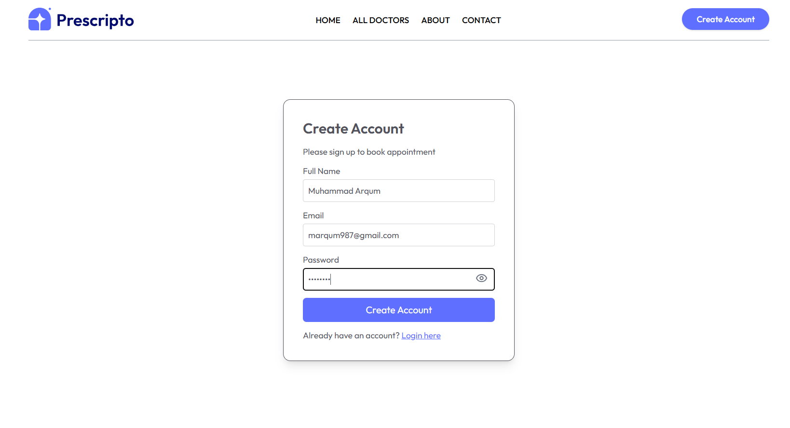
      <br/><b>Register</b>
    </td>
    <td align="center">
      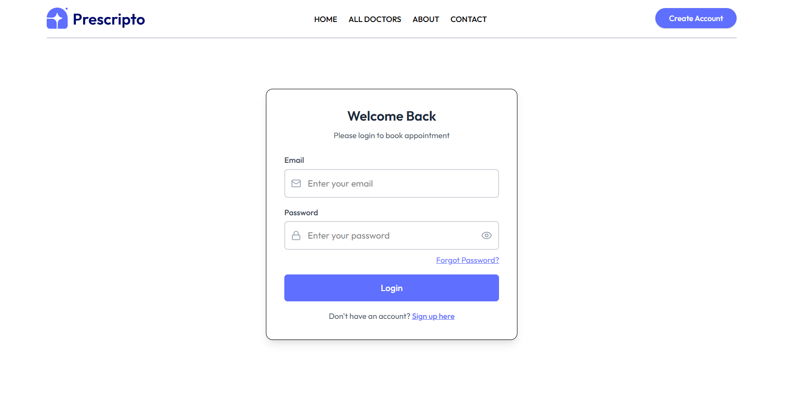
      <br/><b>Login</b>
    </td>
  </tr>
  <tr>
    <td align="center" colspan="2">
      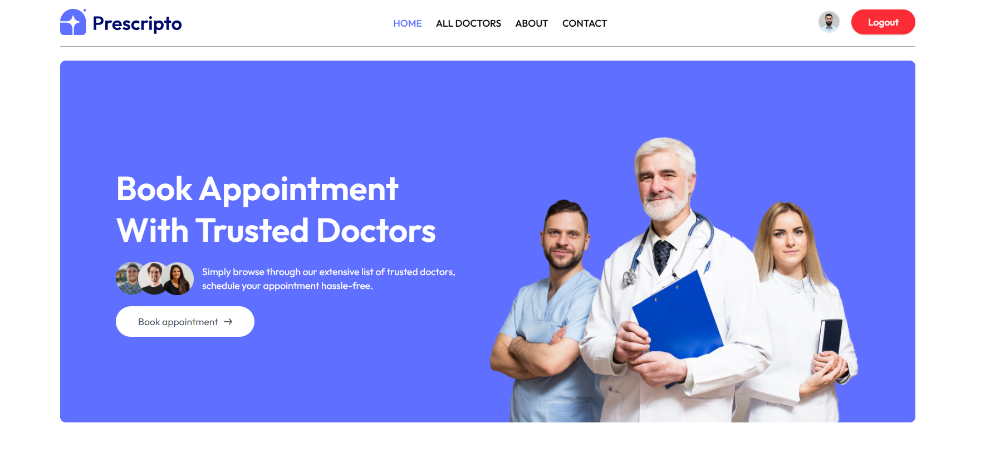
      <br/><b>Home — Hero Section</b>
    </td>
  </tr>
  <tr>
    <td align="center">
      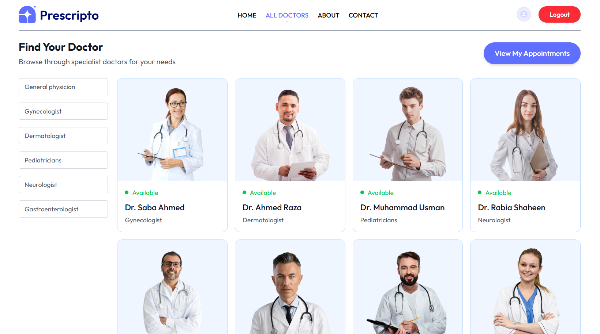
      <br/><b>Browse Doctors by Speciality</b>
    </td>
    <td align="center">
      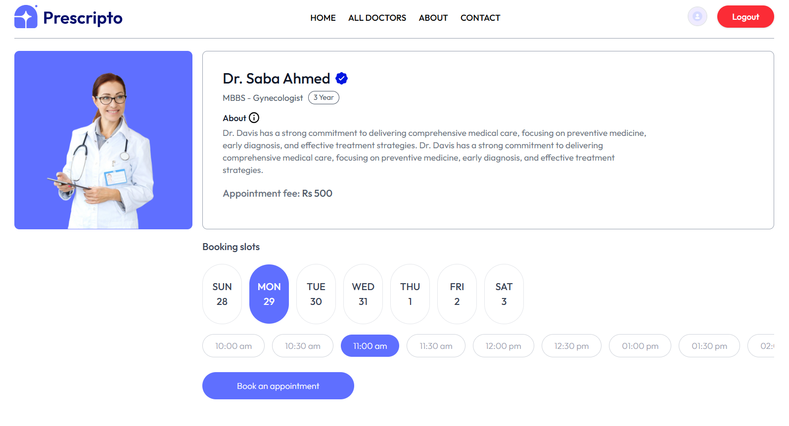
      <br/><b>Appointment Booking</b>
    </td>
  </tr>
  <tr>
    <td align="center">
      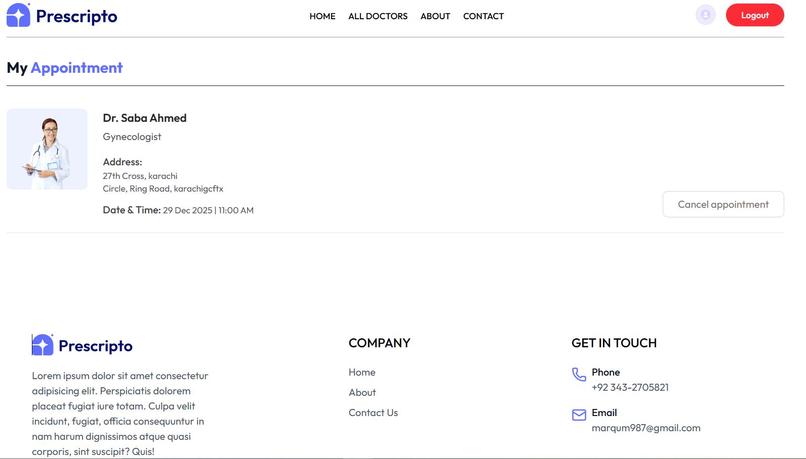
      <br/><b>My Appointments</b>
    </td>
    <td align="center">
      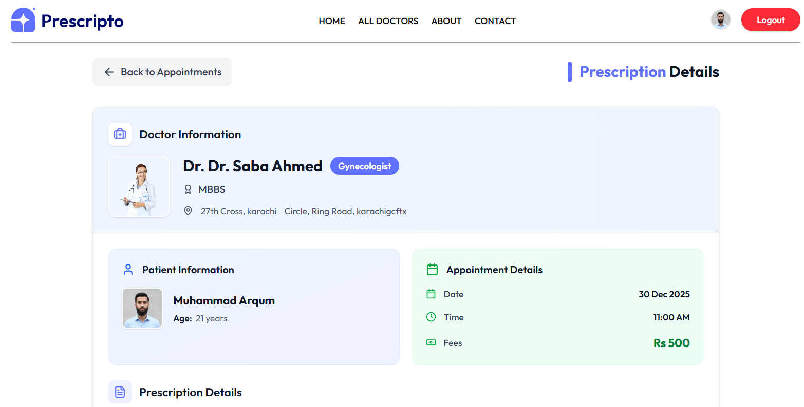
      <br/><b>Digital Prescription</b>
    </td>
  </tr>
  <tr>
    <td align="center" colspan="2">
      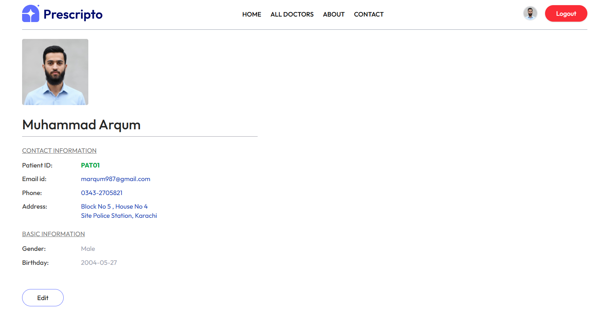
      <br/><b>Patient Profile</b>
    </td>
  </tr>
</table>

---

### 🩺 Doctor Portal

<table>
  <tr>
    <td align="center">
      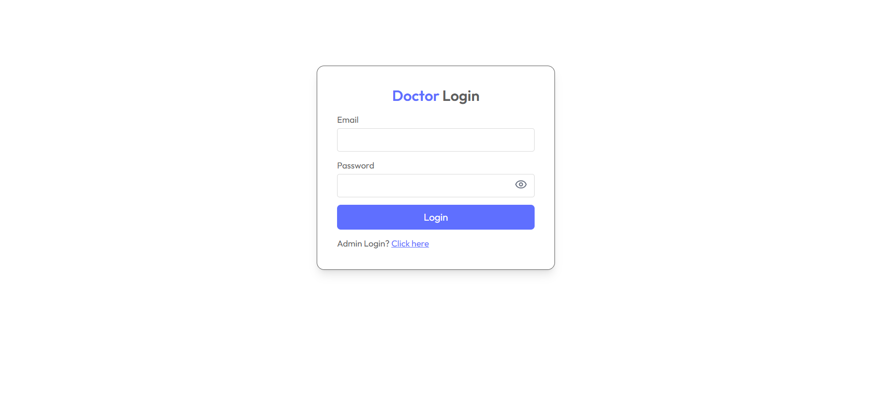
      <br/><b>Doctor Login</b>
    </td>
    <td align="center">
      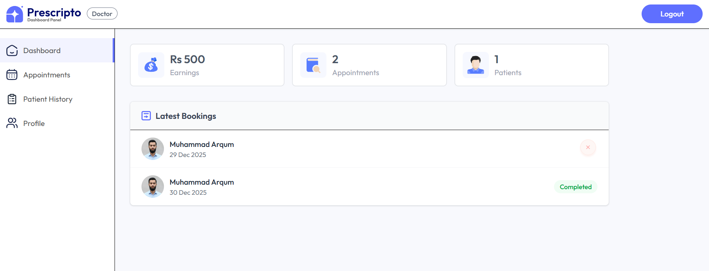
      <br/><b>Doctor Dashboard</b>
    </td>
  </tr>
  <tr>
    <td align="center">
      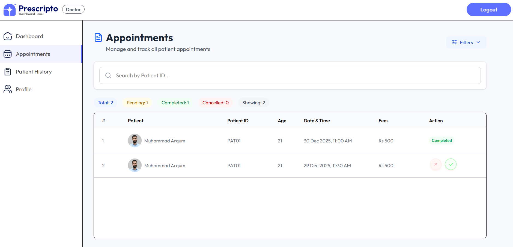
      <br/><b>Appointments List</b>
    </td>
    <td align="center">
      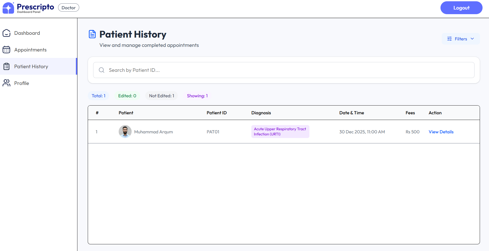
      <br/><b>Patient History</b>
    </td>
  </tr>
  <tr>
    <td align="center" colspan="2">
      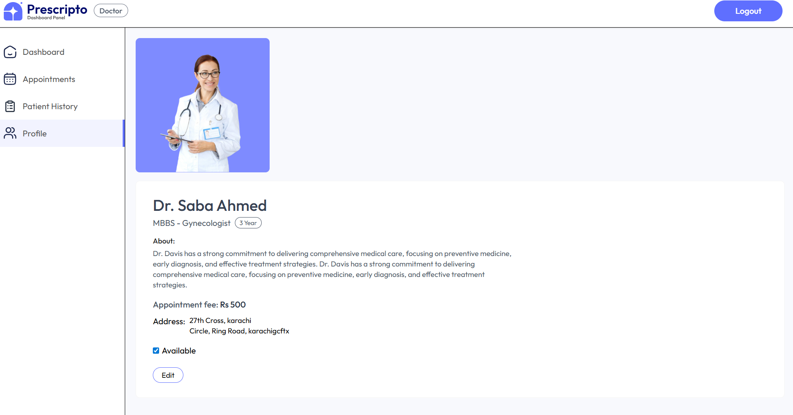
      <br/><b>Doctor Profile</b>
    </td>
  </tr>
</table>

---

### 🛡️ Admin Portal

<table>
  <tr>
    <td align="center">
      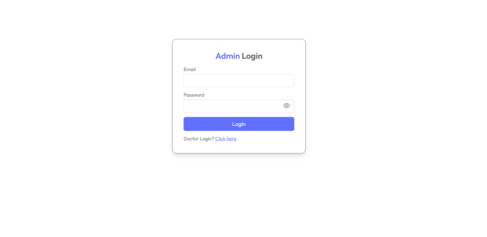
      <br/><b>Admin Login</b>
    </td>
    <td align="center">
      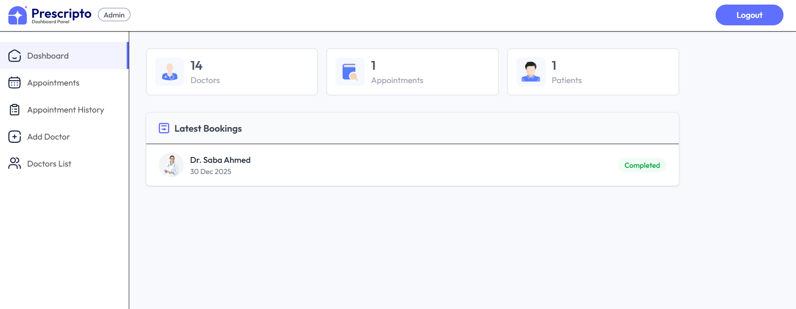
      <br/><b>Admin Dashboard</b>
    </td>
  </tr>
  <tr>
    <td align="center">
      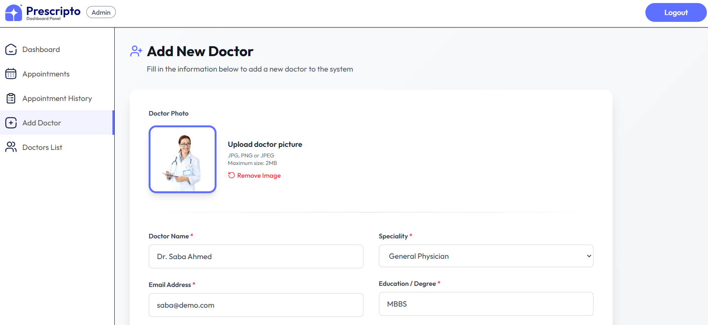
      <br/><b>Add Doctor</b>
    </td>
    <td align="center">
      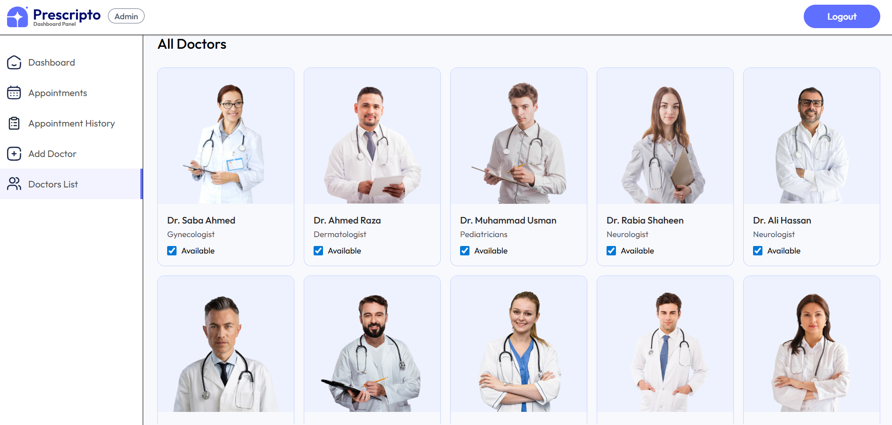
      <br/><b>Doctors List</b>
    </td>
  </tr>
  <tr>
    <td align="center">
      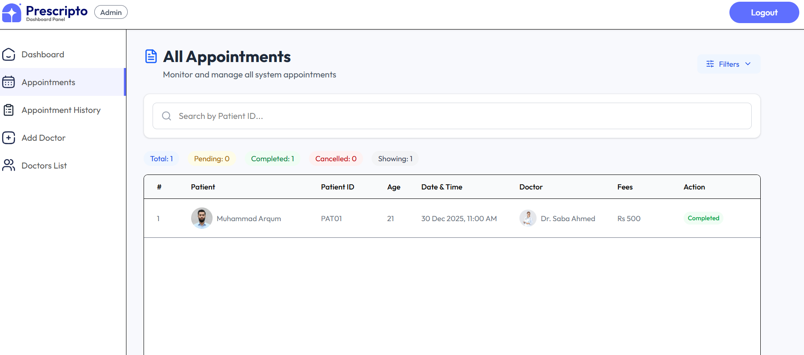
      <br/><b>All Appointments</b>
    </td>
    <td align="center">
      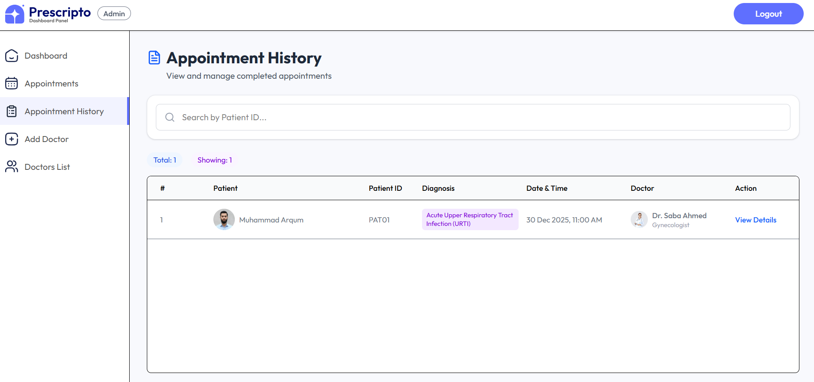
      <br/><b>Appointment History</b>
    </td>
  </tr>
</table>

---

## 🛠 Tech Stack

### Frontend & Admin Panel

| Technology | Version | Role |
|---|---|---|
| **React** | 19.2.0 | UI Framework |
| **Vite** | 7.x | Lightning-fast build tool |
| **Tailwind CSS** | 4.x | Utility-first styling |
| **React Router DOM** | 7.9.6 | Client-side routing |
| **Axios** | 1.13.2 | HTTP client |
| **Lucide React** | 0.555+ | Beautiful icons |
| **React Toastify** | 11.0.5 | Toast notifications |

### Backend

| Technology | Version | Role |
|---|---|---|
| **Node.js + Express** | 5.1.0 | REST API server |
| **MongoDB + Mongoose** | 8.20.0 | NoSQL database & ODM |
| **JWT** | 9.0.2 | Stateless authentication |
| **Bcrypt** | 6.0.0 | Password hashing |
| **Multer** | 2.0.2 | File upload middleware |
| **Cloudinary** | 2.8.0 | Cloud image storage |
| **Nodemailer** | 7.0.12 | Transactional email (OTP) |
| **Validator** | 13.x | Input validation |
| **Dotenv** | 17.x | Environment config |

### Infrastructure & Deployment

| Service | Purpose |
|---|---|
| **Vercel** | Frontend, Admin & Backend hosting |
| **MongoDB Atlas** | Cloud database |
| **Cloudinary** | Image CDN |
| **Gmail SMTP** | Email delivery |

---

## 📁 Project Structure

```
Prescripto/
│
├── 📦 frontend/                        # Patient-facing app (Port: 5173)
│   └── src/
│       ├── assets/                     # Images, SVGs, speciality data
│       ├── components/
│       │   ├── Navbar.jsx              # Sticky responsive navbar
│       │   ├── Footer.jsx              # Footer with contact info
│       │   ├── Header.jsx              # Hero section
│       │   ├── Banner.jsx              # CTA banner
│       │   ├── TopDoctors.jsx          # Featured doctors grid
│       │   ├── RelatedDoctors.jsx      # Same-speciality suggestions
│       │   ├── SpecialityMenu.jsx      # Scrollable speciality filter
│       │   └── CountdownTimer.jsx      # OTP resend countdown
│       ├── context/
│       │   └── AppContext.jsx          # Global state + all API calls
│       └── pages/
│           ├── Home.jsx
│           ├── Doctors.jsx             # Browse & filter doctors
│           ├── Appointment.jsx         # Book appointment page
│           ├── Login.jsx               # Sign up / Login
│           ├── MyProfile.jsx           # Patient profile editor
│           ├── About.jsx
│           ├── Contact.jsx
│           ├── EmailVerify.jsx         # Password reset: Step 1
│           ├── OtpVerify.jsx           # Password reset: Step 2
│           └── ResetPassword.jsx       # Password reset: Step 3
│
├── 📦 admin/                           # Admin + Doctor panel (Port: 5174)
│   └── src/
│       ├── components/
│       │   ├── Navbar.jsx
│       │   └── Sidebar.jsx             # Role-based sidebar (Admin/Doctor)
│       ├── context/
│       │   ├── AdminContext.jsx        # Admin state + API calls
│       │   ├── DoctorContext.jsx       # Doctor state + API calls
│       │   └── AppContext.jsx          # Shared utilities
│       └── pages/
│           ├── Login.jsx               # Shared login for Admin & Doctor
│           ├── Admin/
│           │   ├── Dashboard.jsx       # Stats + latest bookings
│           │   ├── AppointmentHistory.jsx
│           │   ├── AddDoctor.jsx
│           │   └── DoctorsList.jsx
│           └── Doctor/
│               ├── DoctorDashboard.jsx
│               ├── DoctorAppointments.jsx
│               ├── DoctorProfile.jsx
│               └── PatientHistory.jsx
│
└── 📦 backend/                         # Express REST API (Port: 4000)
    ├── config/
    │   ├── mongodb.js                  # Mongoose connection
    │   ├── cloudinary.js               # Cloudinary SDK config
    │   ├── nodemailer.js               # Gmail transporter
    │   └── EmailTemplates.js           # HTML OTP email template
    ├── middlewares/
    │   ├── authUser.js                 # Verify user JWT
    │   ├── authDoctor.js               # Verify doctor JWT (dToken)
    │   ├── authAdmin.js                # Verify admin JWT (aToken)
    │   └── multer.js                   # Disk storage for uploads
    ├── models/
    │   ├── userModel.js                # Patient schema (patientId, OTP, etc.)
    │   ├── doctorModel.js              # Doctor schema (slots_booked, etc.)
    │   ├── appointmentModel.js         # Appointment schema
    │   ├── prescriptionModel.js        # Prescription + edit history schema
    │   └── counterModel.js             # Auto-increment for Patient IDs
    ├── controllers/                    # Route handlers / business logic
    ├── routes/
    │   ├── userRoute.js
    │   ├── doctorRoute.js
    │   └── adminRoute.js
    └── server.js                       # App entry point
```

---

## ⚙️ Installation & Setup

### Prerequisites
- Node.js `>= 18.x`
- MongoDB Atlas account
- Cloudinary account
- Gmail account (with App Password enabled)

---

### Step 1 — Clone the Repository

```bash
git clone https://github.com/ARQUM21/Prescripto.git
cd Prescripto
```

---

### Step 2 — Backend Setup

```bash
cd backend
npm install
```

Create `.env` in `backend/` directory — see the [Environment Variables](#-environment-variables) section below.

```bash
npm run server        # Development with auto-restart
# OR
npm start             # Production
```

✅ API running at: `http://localhost:4000`

---

### Step 3 — Frontend Setup

```bash
cd ../frontend
npm install
```

Create `.env` in `frontend/`:
```env
VITE_BACKEND_URL=http://localhost:4000
```

```bash
npm run dev
```

✅ Patient portal at: `http://localhost:5173`

---

### Step 4 — Admin Panel Setup

```bash
cd ../admin
npm install
```

Create `.env` in `admin/`:
```env
VITE_BACKEND_URL=http://localhost:4000
```

```bash
npm run dev
```

✅ Admin panel at: `http://localhost:5174`

---

## 🔐 Environment Variables

Create a `.env` file inside the `backend/` folder:

```env
# ─── Server ───────────────────────────────────────────────
PORT=4000

# ─── Database ─────────────────────────────────────────────
MONGODB_URI=mongodb+srv://<username>:<password>@cluster.mongodb.net

# ─── Authentication ───────────────────────────────────────
JWT_SECRET=your_strong_random_jwt_secret_key

# ─── Admin Credentials ────────────────────────────────────
ADMIN_EMAIL=admin@yourclinicdomain.com
ADMIN_PASSWORD=your_secure_admin_password

# ─── Cloudinary (Image Storage) ───────────────────────────
CLOUDINARY_NAME=your_cloudinary_cloud_name
CLOUDINARY_API_KEY=your_cloudinary_api_key
CLOUDINARY_SECRET_KEY=your_cloudinary_api_secret

# ─── Email / OTP (Gmail) ──────────────────────────────────
SENDER_EMAIL=your_gmail@gmail.com
APP_PASSWORD=your_16_digit_gmail_app_password
```

> **Gmail App Password Setup:**
> Google Account → Security → 2-Step Verification → App Passwords → Generate for "Mail"

---

## 🔌 API Reference

**Base URL:** `https://your-backend.vercel.app`

---

### 👤 User Routes &nbsp;`/api/user`

| Method | Endpoint | Auth | Description |
|--------|----------|------|-------------|
| `POST` | `/register` | ❌ | Register new patient |
| `POST` | `/login` | ❌ | Patient login |
| `POST` | `/send-reset-otp` | ❌ | Send OTP to email |
| `POST` | `/verify-reset-otp` | ❌ | Verify 6-digit OTP |
| `POST` | `/reset-password` | ❌ | Set new password |
| `GET` | `/get-profile` | ✅ token | Fetch patient profile |
| `POST` | `/update-profile` | ✅ token | Update profile + photo |
| `POST` | `/book-appointment` | ✅ token | Book appointment |
| `GET` | `/appointments` | ✅ token | List appointments |
| `POST` | `/cancel-appointment` | ✅ token | Cancel appointment |
| `POST` | `/get-prescription` | ✅ token | Get prescription |

---

### 🩺 Doctor Routes &nbsp;`/api/doctor`

| Method | Endpoint | Auth | Description |
|--------|----------|------|-------------|
| `GET` | `/list` | ❌ | All doctors list |
| `POST` | `/login` | ❌ | Doctor login |
| `GET` | `/appointments` | ✅ dToken | Doctor's appointments |
| `POST` | `/complete-appointment` | ✅ dToken | Complete + write prescription |
| `POST` | `/cancel-appointment` | ✅ dToken | Cancel appointment |
| `GET` | `/patient-history` | ✅ dToken | All treated patients |
| `POST` | `/edit-prescription` | ✅ dToken | Edit prescription |
| `GET` | `/dashboard` | ✅ dToken | Dashboard stats |
| `GET` | `/profile` | ✅ dToken | Doctor profile |
| `POST` | `/update-profile` | ✅ dToken | Update profile |

---

### 🛡️ Admin Routes &nbsp;`/api/admin`

| Method | Endpoint | Auth | Description |
|--------|----------|------|-------------|
| `POST` | `/login` | ❌ | Admin login |
| `POST` | `/add-doctor` | ✅ aToken | Add new doctor |
| `POST` | `/update-doctor` | ✅ aToken | Edit doctor |
| `POST` | `/all-doctors` | ✅ aToken | All doctors |
| `POST` | `/change-availability` | ✅ aToken | Toggle availability |
| `GET` | `/appointments` | ✅ aToken | All appointments |
| `GET` | `/appointment-history` | ✅ aToken | Completed appointments |
| `POST` | `/delete-appointment-history` | ✅ aToken | Delete history |
| `POST` | `/cancel-appointment` | ✅ aToken | Cancel appointment |
| `GET` | `/dashboard` | ✅ aToken | Platform stats |

---

## 🔮 Future Roadmap

Prescripto is architected with scalability in mind. Here is the planned evolution for clinics and hospitals who want enterprise-grade capabilities:

### 🏗️ Phase 1 — Core Enhancements
- [ ] **Online Payments** — Stripe / JazzCash / Easypaisa for appointment fees
- [ ] **SMS Notifications** — Appointment reminders via Twilio SMS
- [ ] **Email Confirmations** — Auto booking confirmation emails
- [ ] **Doctor Search & Filters** — Search by name, fee range, rating, experience
- [ ] **Ratings & Reviews** — Patients can rate and review doctors

### 🏥 Phase 2 — Hospital-Grade Features
- [ ] **Multi-Branch Support** — One admin managing multiple clinic locations
- [ ] **Department Management** — Organize doctors by hospital departments
- [ ] **Bed / Room Management** — Track inpatient availability
- [ ] **Lab Test Module** — Order tests, upload results, share with patients
- [ ] **Medical Records Vault** — Upload X-rays, MRIs, and reports securely
- [ ] **Pharmacy Integration** — Send prescriptions directly to hospital pharmacy

### 📊 Phase 3 — Analytics & Intelligence
- [ ] **Advanced Analytics Dashboard** — Revenue, peak hours, doctor performance
- [ ] **Patient Demographics** — Age, gender, location-based insights
- [ ] **No-Show Prediction** — ML model to reduce appointment no-shows
- [ ] **AI Symptom Checker** — Pre-appointment chatbot assessment
- [ ] **Smart Doctor Recommendations** — Suggest best doctor based on symptoms

### 📱 Phase 4 — Mobile & Scale
- [ ] **React Native Mobile App** — iOS & Android for patients
- [ ] **Doctor Mobile App** — Manage appointments on the go
- [ ] **Video Consultation** — WebRTC-based telemedicine
- [ ] **Real-time Chat** — In-app messaging between patient and doctor
- [ ] **Multi-language Support** — Urdu, Arabic, and regional languages

### 🔒 Phase 5 — Compliance & Enterprise Security
- [ ] **Audit Logs** — Full activity logs for regulatory compliance
- [ ] **Data Export** — Patient data as PDF / Excel reports
- [ ] **HIPAA / HL7 FHIR Compliance** — International healthcare standards

---

## 🙏 Acknowledgements

This project was built with the help of some amazing open-source tools, services, and communities:

- [**React**](https://react.dev) — The UI library that powers all three portals
- [**Vite**](https://vitejs.dev) — Blazing fast frontend build tool
- [**Tailwind CSS**](https://tailwindcss.com) — Utility-first CSS framework for rapid UI development
- [**Express.js**](https://expressjs.com) — Minimal and flexible Node.js web framework
- [**MongoDB Atlas**](https://www.mongodb.com/atlas) — Cloud-hosted NoSQL database
- [**Mongoose**](https://mongoosejs.com) — Elegant MongoDB object modeling for Node.js
- [**Cloudinary**](https://cloudinary.com) — Cloud image storage and delivery
- [**Nodemailer**](https://nodemailer.com) — Node.js module for sending emails
- [**JWT**](https://jwt.io) — Secure stateless authentication standard
- [**Lucide React**](https://lucide.dev) — Beautiful & consistent icon library
- [**Vercel**](https://vercel.com) — Seamless deployment platform for frontend & backend
- [**Shields.io**](https://shields.io) — Beautiful README badges
- The entire **open-source community** whose tools made this project possible 🌍

---

## 🤝 Contributing

1. Fork the repository
2. Create a feature branch: `git checkout -b feature/your-feature`
3. Commit: `git commit -m 'Add: your feature'`
4. Push: `git push origin feature/your-feature`
5. Open a Pull Request

---

## 👨‍💻 Author

<div align="center">

**Muhammad Arqum**
*Full Stack Developer — Building digital solutions for the healthcare industry*

<br/>

[](https://www.linkedin.com/in/muhammadarqumtariq/)
[](mailto:marqum987@gmail.com)
[](tel:+923432705821)

📍 Karachi, Pakistan

<br/>

*Interested in deploying Prescripto for your clinic or hospital? Feel free to reach out!*

</div>

---

## 📄 License

This project is licensed under the **MIT License** — free to use, modify, and distribute.

---

<div align="center">

**⭐ If Prescripto helps your clinic or hospital, please give it a star! ⭐**

*Built with ❤️ for the healthcare community of Pakistan and beyond*

*© 2026 Prescripto — All Rights Reserved*

</div>
# Priscripto

# Hackathon_Final

